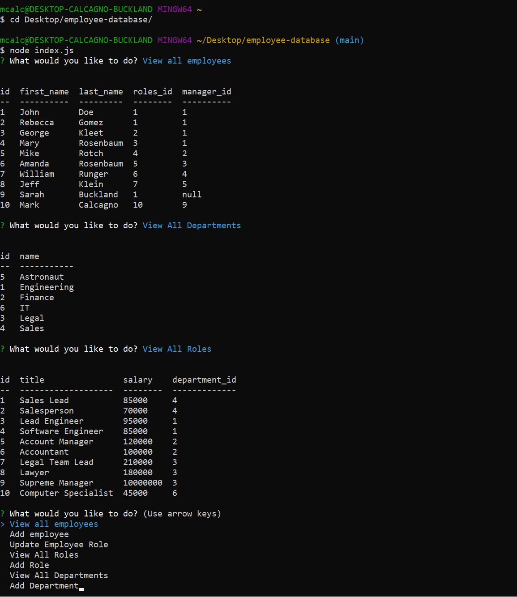

# Employee Database

## Description
In this application, the user will have access to their team's data by inputting it into the console.  The information input there will be stored in a database, where the user will be able to quickly reference their team's information. The videos and screenshot below demonstrate this. 

## Table of Contents
- [Installation](#installation)
- [Usage](#usage)
- [Credits](#credits)

## Installation
Programs necessary for usage is Node.js, but dependencies must be added for it to work.  Inquirer, Jest and Express must be installed into the node_modules folder using, "npm install 'program'".  Finally, this must be run using Node.js, and it cannot be deployed.

## Usage
If one has correctly downloaded the necessary code and has access to what has been written by me, then open the console and navigate to the main folder.  Input "node index.js", and the questionaire will begin.  The user will be provided with a series of options; viewing the employees, roles and departments, and editing the employees, roles and departments.  On screen instructions allow the user to easily add or update previous entries.

## Screenshot

## Links
Video demo of Application: https://youtu.be/VvdJvZ2Ay4w
Github: https://github.com/mcalcagno47/employee-database  

The site: Not applicable in this situation, as it is running locally

## Credits
Mark Calcagno
